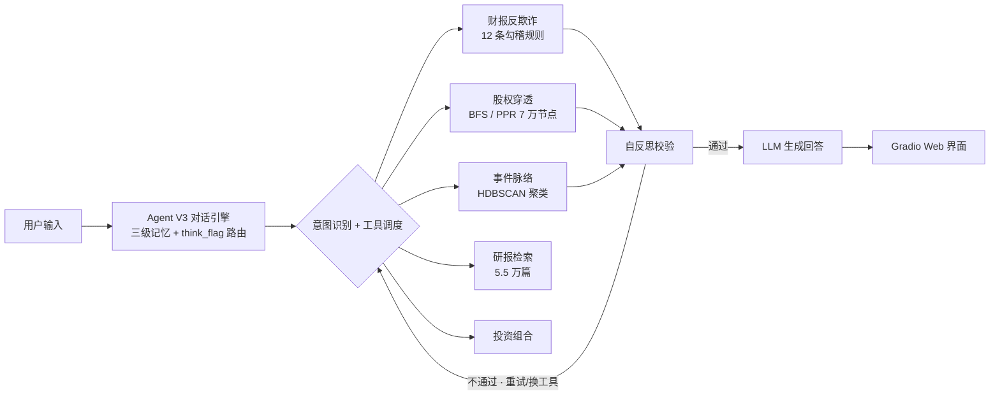

# 金融智能问答系统 · Agentic AI 财报反欺诈 / 股权穿透 / 知识图谱

> 实习期间完成的完整个人项目 · 选题源自第五届中国研究生金融科技创新大赛（东吴证券赛题）
> 《基于 Agentic AI 的金融长上下文推理、图谱穿透与财报反欺诈智能问答》

一个面向真实 A 股数据的金融智能问答系统：以 LLM 自主决策的 Agent 为核心，串起**财报反欺诈、多层股权穿透、舆情事件脉络、券商研报检索**四条能力链路，并提供 Web 交互界面与 Obsidian 知识图谱导出。

## 项目亮点

- **Agentic 自纠错闭环**：意图识别 → 工具调度 → 执行 → 验证 → 重试，自纠错成功率 **100%**；LLM 不可用时自动降级为关键词匹配（准确率 87%）。
- **7 万+ 节点股权图谱**：BFS 多跳穿透 + Personalized PageRank（迁移自 HippoRAG 论文并改进为持股加权），穿透链路准确率 **99.67%**，可输出「自然人 → 壳公司 → 资管计划 → 上市公司」的完整带权重逻辑链。
- **12 条勾稽规则财报反欺诈**：存货/营收比、经营现金流/净利润倒挂、财务费用异常等，叠加同业相对阈值与模式组合评分，输出可解释的「预警点 + 数据对比 + 可能造假模式」研判报告。
- **三级记忆支持超长对话**：短期滑窗 + 中期 LLM 摘要 + 长期语义向量索引，面向 0.5M+ token 上下文的记忆管理策略。

## 架构



## 数据规模

| 数据源 | 规模 |
|------|------|
| 测试问答集 | 1,410 条 / 35 会话 |
| 股东持股 | 58.0 万条 / 6,161 只股票 / 7.1 万股东 |
| 公司公告 | 7,311 条 / 2,585 只股票（风险事件占 87.9%） |
| 三大财务报表 | 4.0 万条 / 6,713 只股票（2023-12 ~ 2026-03） |
| 券商研报 | 5.5 万篇 / 3,438 只股票 / 110 家券商 |

## 核心模块

| 模块 | 文件 | 职责 |
|------|------|------|
| 对话 Agent | `agent_v3.py` | 分级记忆 + 自适应路由 + 自纠错闭环 |
| 财报反欺诈 | `fraud_detector.py` | 12 条勾稽规则 + 多期趋势 + LLM 研判 |
| 股权穿透 | `equity_penetration.py` | 70K 节点图 + BFS 多跳 + 有效持股计算 |
| 穿透引擎 | `penetration_engine.py` | 壳公司/实控人识别 + 穿透路径 |
| 实体消歧 | `entity_resolver.py` | rapidfuzz 模糊匹配归一化 |
| 事件脉络 | `event_clustering.py` / `event_pipeline.py` | HDBSCAN 事件簇 + 时间线 |
| 图谱工具 | `graph_core.py` / `graph_tools.py` | 图构建与 Agent 工具封装 |
| 数据处理 | `data_processor.py` | 加载、清洗、标准化全部 5 类数据 |
| Web 界面 | `app.py` | Gradio 5 标签页 + Plotly 图表 |
| 投资组合 | `portfolio.py` | 自选股/持仓管理 |
| 评测基准 | `eval_benchmark.py` | 8 项赛题指标全量评测 |

## 评测结果

| 指标 | 本项目 | 赛题目标 | 达成 |
|------|--------|---------|------|
| 自纠错成功率 | **100%** | 80% | ✅ |
| 股权穿透链路准确率 | **99.67%** | 85% | ✅ |
| 舆情事件簇召回率 | **98.81%** | 85% | ✅ |
| Agent API 调用命中率 | 91.3% | 92% | 接近 |
| 长文本问答事实召回/准确率 | 84.5% | 90% | 待优化 |

> 完整评测脚本：`python eval_benchmark.py`（结果落盘至 `output/`）

## 快速开始

### 1. 环境

```bash
pip install -r requirements.txt
```

### 2. 配置 API

```bash
cp .env.example .env   # 填入你的 API Key
```

### 3. 数据

将比赛原始数据放入 `data_raw/{1..5}/`，运行预处理生成清洗后数据：

```bash
python data_processor.py     # 生成 data_processed/*.pkl
```

### 4. 启动

```bash
python app.py                # Web 界面 http://127.0.0.1:7860
python agent_v3.py           # 命令行对话
python fraud_detector.py --top 20          # 财报风险排行
python equity_penetration.py 688765.SH     # 股权穿透
```

## 项目结构

```
知识图谱项目/
├── data_raw/               # 原始比赛数据（不入库，需自行放置）
├── data_processed/         # 清洗后数据（data_processor.py 生成，不入库）
├── obsidian-kb/            # Obsidian 项目知识图谱笔记
├── agent_v3.py             # 对话 Agent（核心）
├── fraud_detector.py       # 财报反欺诈
├── equity_penetration.py   # 股权穿透
├── penetration_engine.py   # 穿透引擎
├── entity_resolver.py      # 实体消歧
├── event_*.py              # 事件聚类/脉络
├── graph_*.py              # 图谱核心/工具
├── app.py                  # Web 界面
├── eval_benchmark.py       # 评测基准
├── .env.example            # 配置模板
└── requirements.txt
```

## 技术栈

`Python` · `OpenAI 兼容 LLM API` · `Gradio` · `Plotly` · `pandas/numpy` · `networkx` · `HDBSCAN` · `rapidfuzz` · `scikit-learn` · `Obsidian`
