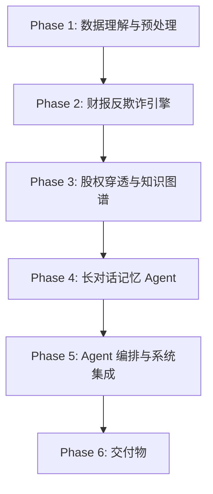

# 项目总览

> **第五届中国研究生金融科技创新大赛** — 东吴证券"揭榜挂帅"赛题
> 命题名称：基于 Agentic AI 的金融长上下文推理、图谱穿透与财报反欺诈智能问答

## 核心目标

构建一套基于 **Agentic AI** 的复杂金融语境推理与问答算法，为投资者提供一个高精确、强逻辑、防幻觉的"全能型金融AI幕僚"。

## 总体路线

## 三大攻关任务

| 任务 | 说明 | 核心指标 |
|------|------|----------|
| [[任务1-长对话记忆Agent]] | 0.5M+ Tokens 多轮对话，自适应路由 | 召回率 >= 90% |
| [[任务2-股权穿透与图谱]] | 多层股权穿透，事件脉络推演 | 穿透准确率 >= 85% |
| [[任务3-财报反欺诈引擎]] | 跨科目勾稽，风险评分 | F1 >= 85% |

## 项目导航

- [[01-数据理解与预处理]] — 7步数据清洗与探索
- [[02-财报反欺诈引擎]] — 财务排雷规则 + LLM研判
- [[03-股权穿透与知识图谱]] — Neo4j图库 + 事件聚类
- [[04-长对话记忆Agent]] — 分级记忆 + 自纠错路由
- [[05-Agent编排与集成]] — 多Agent串联 + 性能优化
- [[06-交付物]] — Web Demo + 白皮书 + PPT
- [[技术栈]] — 推荐技术选型
- [[数据集清单]] — 数据目录与规模
- [[关键指标]] — 全部量化目标
- [[LLMOps平台]] — API配置与额度
