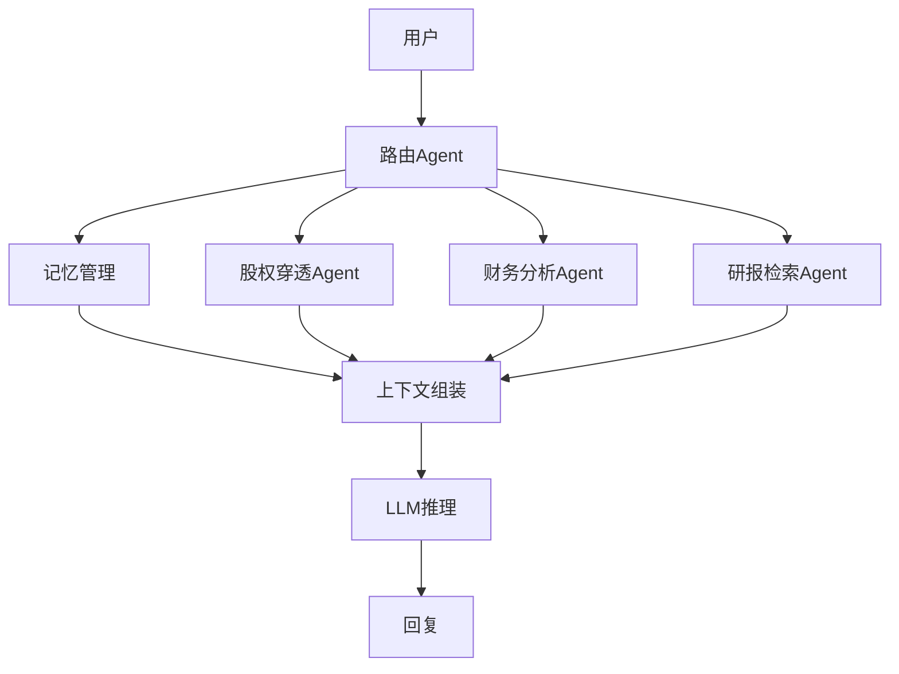

# Phase 5：Agent 编排与系统集成

> 工期：3-5天 | 依赖：Phase 2, 3, 4

## 架构

## 工具清单

| Tool | Agent |
|------|-------|
| [[图谱穿透Tool]] | 股权穿透Agent |
| [[财务排雷Tool]] | 财务分析Agent |
| [[研报检索Tool]] | 研报Agent |
| [[公告查询Tool]] | 通用路由 |

## 端到端测试

覆盖跨任务交叉场景（如"先查穿透再分析财务"），工具调用延迟 <= 5s

## 关联

- [[04-长对话记忆Agent]]
- [[06-交付物]]
